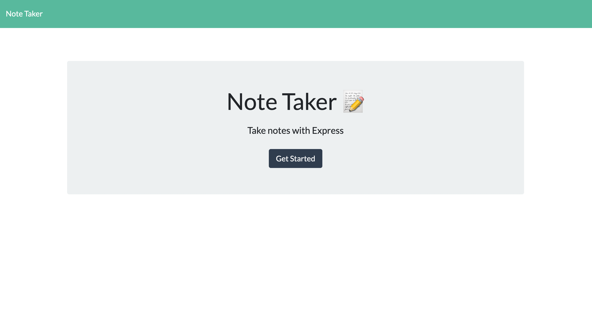

# Note-Taker
This goal of this project is to debug a Note Taker project. 
## Description
This application allows the user to take notes and save them.

## Table of Contents
- [Installation](#installation)
- [Usage](#usage)
- [Preview](#preview)
- [License](#license)

## Installation
- Node.js 
- run the follwoing command in terminal: npm i
- Express 
- run the following command in terminal: npm i express

## Usage
- When user selets textbox 
- Then user will have the ability to type a note
- When user clicks the 'save' icon 
- Then user will see display text stored aside

## Preview 
<a href='https://young-sea-88318.herokuapp.com/'>Dloyed App Here!</a>

## License
 Copyright (C) 2007 Free Software Foundation, Inc. <https://fsf.org/>
 Everyone is permitted to copy and distribute verbatim copies
 of this license document, but changing it is not allowed.
---